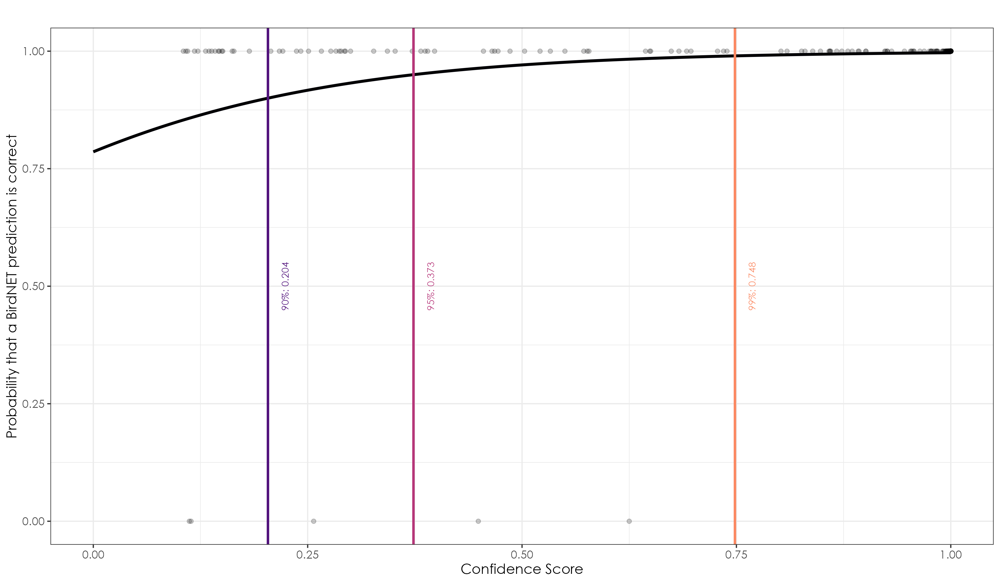

---
editor_options:
  chunk_output_type: console
---

# Thresholding BirdNET outputs 

After having downloaded, pre-processed (following appropriate naming conventions and data management practices), creating a custom classifier for the St. Vincent's Amazon and the Whistling Warbler, and validating those outputs using Raven Pro, we set a threshold above which the probability of detection of a species is at 90%, 95% or 99%. We can then use this threshold to filter all outputs from BirdNET and create a dataset of detections.   

## Load required libraries  
```{r}
library(tidyverse)
library(dplyr)
library(stringr)
library(ggplot2)
library(data.table)
library(extrafont)
library(sf)
library(raster)
library(viridis)

# for plotting
library(scales)
library(ggplot2)
library(ggspatial)
library(colorspace)
library(scico)
```

## Load selection tables from Raven Pro  

Using Raven Pro, 200 random outputs from BirdNET with a range of confidence scores from 0.1 to 0.99 were manually validated and saved as a text file. We will load this text file and run a binomial glm to set a threshold. Please note that the validations were done for both the St. Vincent's Amazon and the Whistling Warbler, but the classifier for the warbler is not doing a good job of retrieving detections of the species. We will be only analyzing the parrot data below and in other scripts.  
```{r}
# read table
table <- read.table("results/birdNET-segments/stVincentAmazon/stVincentAmazon.Table.1.selections.txt", sep = "\t", header = TRUE)

# remove duplicates associated with waveform in the selection table
table <- table %>%
    filter(View == "Spectrogram 1")

# extract confidence scores
table$Score <- as.numeric(substr(table$Begin.File, 1, 5))

# run model
model <- glm(Valid ~ Score, family = "binomial", data = table)

# create predictions
prediction.range.conf <- seq(0, 1, .001)
predictions.conf <- predict(model,                            list(Score = prediction.range.conf), type = "r")

# calculate thresholds
threshold90 <- (log(.90 / (1 - .90)) - model$coefficients[1]) / model$coefficients[2]
threshold95 <- (log(.95 / (1 - .95)) - model$coefficients[1]) / model$coefficients[2]
threshold99 <- (log(.99 / (1 - .99)) - model$coefficients[1]) / model$coefficients[2]

# clean up labels for visualization
threshold90_label <- round(threshold90, 3)
threshold95_label <- round(threshold95, 3)
threshold99_label <- round(threshold99, 3)

# set colors for the threshold lines
viz_colors <- magma(5)
curve_color <- viz_colors[1]
threshold_colors <- viz_colors[c(2, 3, 4)]

# visualization
fig_birdNET_threshold <- ggplot(table, aes(x = Score, y = Valid)) +
    geom_point(alpha = 0.2) +
    geom_line(
      data = data.frame(
        x = prediction.range.conf,
        y = predictions.conf
      ),
      aes(x = x, y = y),
      color = curve_color,
      size = 1.2
    ) +
    geom_vline(xintercept = threshold90, color = threshold_colors[1], size = 1) +
    geom_vline(xintercept = threshold95, color = threshold_colors[2], size = 1) +
    geom_vline(xintercept = threshold99, color = threshold_colors[3], size = 1) +
    # add threshold labels with offset
    annotate("text",
      x = pmin(pmax(threshold90, 0.05), 0.95) + 0.02,
      y = 0.5,
      label = paste("90%:", threshold90_label),
      color = threshold_colors[1],
      family = "Century Gothic",
      angle = 90,
      hjust = 0.5,
      size = 3
    ) +
    annotate("text",
      x = pmin(pmax(threshold95, 0.05), 0.95) + 0.02,
      y = 0.5,
      label = paste("95%:", threshold95_label),
      color = threshold_colors[2],
      family = "Century Gothic",
      angle = 90,
      hjust = 0.5,
      size = 3
    ) +
    annotate("text",
      x = pmin(pmax(threshold99, 0.05), 0.95) + 0.02,
      y = 0.5,
      label = paste("99%:", threshold99_label),
      color = threshold_colors[3],
      family = "Century Gothic",
      angle = 90,
      hjust = 0.5,
      size = 3
    ) +
    labs(
      title = "",
      x = "Confidence Score",
      y = "Probability that a BirdNET prediction is correct"
    ) +
    theme_bw() +
    theme(
      text = element_text(family = "Century Gothic"),
      plot.title = element_text(family = "Century Gothic", size = 14),
      axis.title = element_text(family = "Century Gothic", size = 12),
      axis.text = element_text(family = "Century Gothic", size = 10)
    ) 

ggsave(fig_birdNET_threshold, filename = "figs/fig_birdNET_thresholds.png", width = 12, height = 7, device = png(), units = "in", dpi = 300)
dev.off()
```



## Creating a subset of data using the thresholds above

Based on the above plot, the threshold at which the probability of a true positive/detection is 90%, 95% or 99% is 0.204, 0.373 and 0.748, respectively. We will use the threshold at 95% to filter all detections for the St. Vincent's Amazon.

```{r}
## each prediction with an associated confidence score for a given species is stored within a .txt file within a series of sub-folders associated with different ranges and the way in which our data management and organization was carried out.

## we write functions to extract appropriate columns and filter by species

# let's first write a function to process a single file
process_file <- function(file_path) {
  
  # read the text file
  data <- read.csv(file_path, sep="\t", stringsAsFactors=FALSE)
  
  # filter for StVincentAmazon
  filtered_data <- data %>%
    filter(Species.Code == "stVincentAmazon")
  
  if(nrow(filtered_data) > 0) {
    # extract file name without extension
    file_name <- basename(file_path)
    file_name <- str_replace(file_name, ".BirdNET.selection.table", "")
    
    # split the filename into components
    parts <- str_split(file_name, "_")[[1]]
    
    # create new columns from filename components
    filtered_data$range_code <- parts[1]
    filtered_data$survey_point_number <- parts[2]
    filtered_data$deployment_cycle <- parts[3]
    filtered_data$date <- parts[5]
    filtered_data$time <- str_replace(parts[6], ".txt", "")
    filtered_data$site_protocol_code <- paste(parts[1], parts[2], parts[3], sep="_")
    
    return(filtered_data)
  }
  return(NULL)
}

# function to recursively find all txt files
find_txt_files <- function(path) {
  list.files(path, pattern = "\\.txt$", recursive = TRUE, full.names = TRUE)
}

# using the above functions to process data from the root directory
main <- function() {
  
  # set your root directory
  root_dir <- "results/birdNET-outputs/" # replace with your actual path
  
  # get all txt files
  txt_files <- find_txt_files(root_dir)
  
  # process all files and combine results
  results <- list()
  
  for(file in txt_files) {
    result <- process_file(file)
    if(!is.null(result)) {
      results[[length(results) + 1]] <- result
    }
  }
  
  # combine all results into one dataframe
  final_df <- bind_rows(results)
  
  return(final_df)
}

# run the main function
result_data <- main()

## we will now choose a subset of columns from the above object and filter predictions equal to or above the threshold for 95% probability of detections  
datSubset <- result_data %>%
  dplyr::select(Species.Code, Confidence, range_code,  survey_point_number, deployment_cycle, date, 
                time,site_protocol_code) %>%
  filter(Confidence >= threshold95)

# rename columns and cleanup
datSubset$common_name <- "St.Vincent Amazon"
datSubset$scientific_name <- "Amazona guildingii"
datSubset <- datSubset[,-1]
names(datSubset)[1] <- "confidence_score"

# include filename
datSubset <- datSubset %>%
  mutate(filename = paste0(site_protocol_code,"_",
                           date,"_",time))

# A summary of what we have so far
# The total number of predictions from BirdNET: 97323 
# At 99% probability: 64754 detections
# At 95% probability: 79069 detections
# At 90% probability: 87767 detections

# exploratory visualization of distribution of confidence scores based on the threshold set
fig_conf_score <- ggplot(datSubset, aes(x = confidence_score, fill = survey_point_number)) +
  geom_histogram(binwidth = 0.1, position = "dodge", 
                 color = "black") +
  facet_wrap(~ survey_point_number, scales = "free_y") +
  labs(title = "Confidence Score Distribution by Site",
       x = "Confidence Score",
       y = "Count") +
  theme_bw()

ggsave(fig_conf_score, filename = "figs/fig_99p_distribution.png", width = 12, height = 7, device = png(), units = "in", dpi = 300)
dev.off()

# for now, we work with a dataset of detections for a probability >=95%
# write to file
write.csv(datSubset, "results/datSubset.csv", row.names = FALSE)
```


