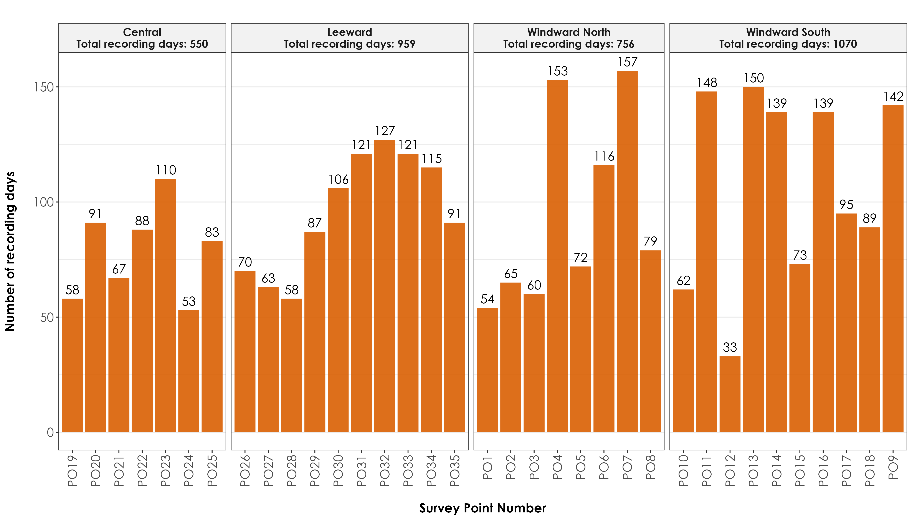
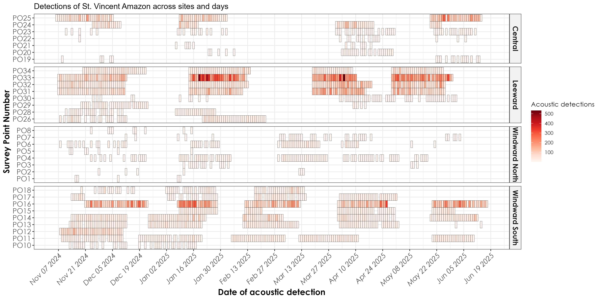
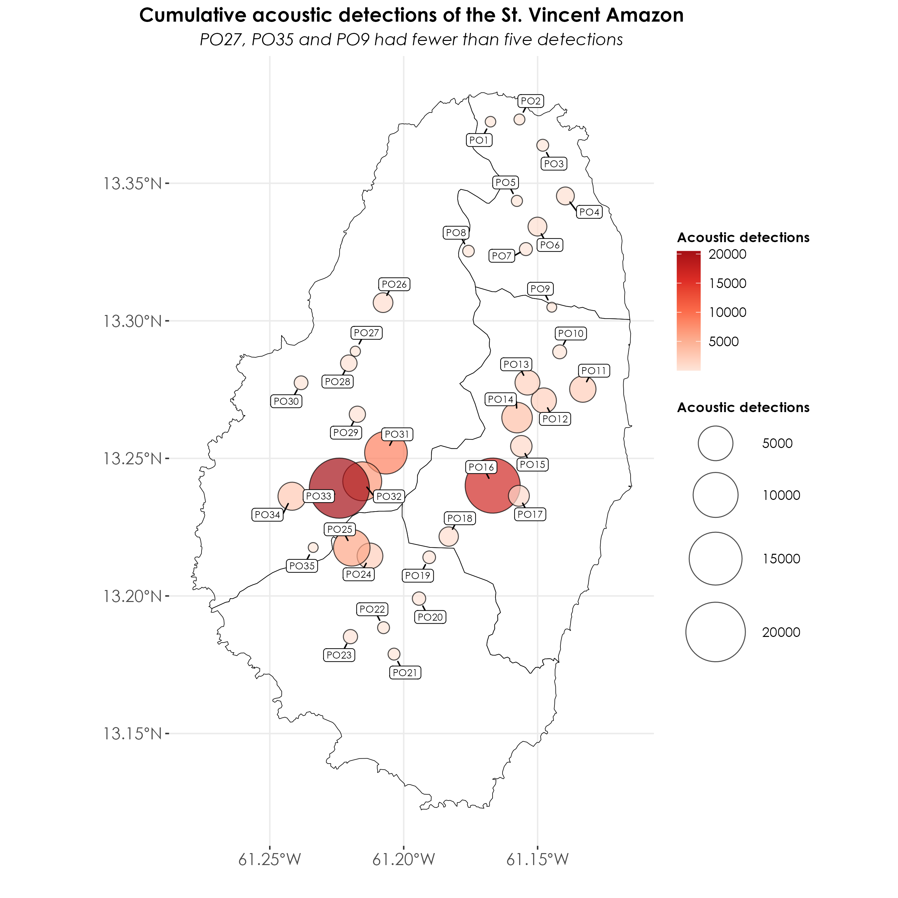
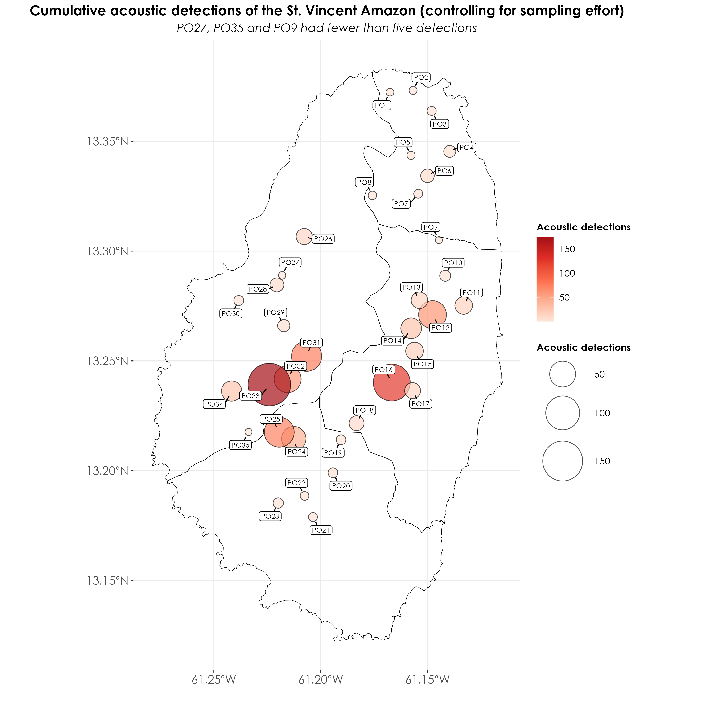

---
editor_options:
  chunk_output_type: console
---

# Analysis of BirdNET detections

In this script, we carry out spatial and temporal analyses of acoustic detections that were thresholded in the previous script. We work with a subset of detections that have a 95% probability of being a true positive.  

## Load necessary libraries
```{r}
library(tidyverse)
library(dplyr)
library(stringr)
library(ggplot2)
library(data.table)
library(extrafont)
library(sf)
library(raster)
library(stars)
library(spatstat)
library(mapview)

# for plotting
library(scales)
library(ggplot2)
library(ggspatial)
library(colorspace)
library(scico)
library(RColorBrewer)
library(paletteer)
```

## Load acoustic data and metadata
```{r}
metadata <- read.csv("data/acoustic-metadata.csv")
acoustic_data <- read.csv("results/datSubset.csv")
```

## Visualizing sampling effort

How much acoustic data was collected? Using information on the first and last date of recorded acoustic data, we could visualize the total recorded days across months and sites.

```{r}
# ensure structure of dates in the metadata file is date
metadata$first_file_date <- ymd(metadata$first_file_date)
metadata$last_file_date <- ymd(metadata$last_file_date)

# extract the common start and end dates across sites
# this is to figure out what are periods across which all sites recorded simultaneously
common_start_date <- max(metadata$first_file_date, na.rm = T)
common_end_date <- min(metadata$last_file_date, na.rm = T)

## extract the common start and end dates across sites
common_start_date <- max(metadata$first_file_date, na.rm = T)
common_end_date <- min(metadata$last_file_date, na.rm = T)

## create a factor of survey_point_number ordered by range_name
metadata <- metadata %>%
  arrange(range_name, survey_point_number) %>%
  mutate(survey_point_ordered = factor(survey_point_number, 
                 levels = unique(survey_point_number)))

## for the visualization
range_info <- metadata %>%
  group_by(range_name) %>%
  summarise(min_point = min(as.numeric(survey_point_ordered)),
            max_point = max(as.numeric(survey_point_ordered)))

# create date breaks starting in November 2024
date_breaks <- seq(as.Date("2024-11-01"), 
                  max(metadata$last_file_date, na.rm = TRUE),
                  by = "month")

fig_samplingEffort <- metadata %>%
  filter(!is.na(first_file_date)) %>%
  ggplot(., aes(y = survey_point_ordered)) +  
  geom_segment(aes(x = first_file_date, xend = last_file_date, 
                   yend = survey_point_ordered), 
               color = "#d95f02", size = 1) +
  geom_vline(xintercept = as.numeric(common_start_date), linetype = "dotted", color = "#1b9e77", size = 1) +
  geom_vline(xintercept = as.numeric(common_end_date), linetype = "dotted",  color = "#1b9e77", size = 1) +
    # add vertical lines for range boundaries
  geom_hline(data = range_info, 
             aes(yintercept = min_point - 0.5),
             color = "grey20", size = 0.8) +
  geom_hline(data = range_info, 
             aes(yintercept = max_point + 0.5),
             color = "grey20", size = 0.8) +
  # add range names as annotations
  geom_text(data = range_info, 
            aes(x = min(metadata$first_file_date, na.rm = TRUE),
                y = (min_point + max_point)/2,
                label = range_name),
            hjust = 0.5, color = "grey10") +
  geom_text(aes(x = common_start_date, y = Inf, 
                label = format(common_start_date, "%Y-%m-%d")), 
            vjust = 2, hjust = 0.5, color = "black") +
  geom_text(aes(x = common_end_date, y = Inf, 
                label = format(common_end_date, "%Y-%m-%d")), 
            vjust = 2, hjust = 0.5, color = "black") +
 scale_x_date(
    limits = as.Date(c("2024-11-01", "2025-07-01")), 
    breaks = seq(as.Date("2024-11-01"), as.Date("2025-07-01"), by = "month"),
    date_labels = "%b %Y",
    expand = expansion(mult = c(0.05, 0))) +
  labs(title = "Sampling Effort",
       x = "Acoustic Recording Dates",
       y = "Survey Point Number") +
  theme_bw() +
  theme(
    text = element_text(family = "Century Gothic", size = 14, face = "bold"),
    plot.title = element_text(
      family = "Century Gothic",
      size = 15, face = "bold"
    ),
    plot.subtitle = element_text(
      family = "Century Gothic",
      size = 15, face = "bold", color = "#1b2838"
    ),
    axis.title = element_text(
      family = "Century Gothic",
      size = 18, face = "bold"
    ),
    legend.position = "top",
    legend.title = element_blank(),
    legend.text = element_text(size = 10),
    axis.text.x = element_text(angle = 45, hjust = 1)
  )

ggsave(fig_samplingEffort, filename = "figs/fig_sampling_effort.png", width = 14, height = 7, device = png(), units = "in", dpi = 300)
dev.off()
```

  

## How much data was recorded at each site?

Creating a bar plot with total number of days of recording at each site. Please refer to the metadata to ascertain the configuration and deployment details for the recorders. 
```{r}
## total number of recorded days
recording_days <- metadata %>%
  rowwise() %>%
  mutate(
    days = list(seq(first_file_date, last_file_date, by = "day"))
  ) %>%
  unnest(days) %>%
  distinct(days, survey_point_number) %>%
  group_by(survey_point_number) %>%
  summarise(
    total_recording_days = n(),
    .groups = 'drop'
  ) %>%
  arrange(desc(total_recording_days)) %>%
  left_join(metadata %>% 
              dplyr::select(survey_point_number, range_name) %>% 
              distinct(),
            by = "survey_point_number")

# calculate total days per range
range_totals <- recording_days %>%
  group_by(range_name) %>%
  summarise(total_days = sum(total_recording_days))

# The rest of your plotting code remains the same
fig_totalRecordedDays <- recording_days %>%
  arrange(range_name, survey_point_number) %>%
  mutate(survey_point_number = factor(survey_point_number, levels = unique(survey_point_number))) %>%
  ggplot(., aes(x = survey_point_number, y = total_recording_days)) +
  geom_bar(stat = "identity", fill = "#d95f02", alpha = 0.9) +
  geom_text(aes(label = total_recording_days), 
            vjust = -0.5, size = 5, family = "Century Gothic") +
  facet_grid(. ~ range_name, scales = "free_x", space = "free_x",
             labeller = labeller(range_name = function(x) 
               paste0(x, "\nTotal recording days: ", 
                     range_totals$total_days[range_totals$range_name == x])))+
  theme_bw() +
  labs(
    x = "\nSurvey Point Number",
    y = "Number of recording days\n",
    title = ""
  ) +
  theme(
    axis.title = element_text(
      family = "Century Gothic",
      size = 14, face = "bold"
    ),
    axis.text = element_text(family = "Century Gothic", size = 14),
    axis.text.x = element_text(angle = 90, vjust = 0.5, hjust = 1),
    legend.position = "none",
    plot.title = element_text(
      family = "Century Gothic",
      size = 16, face = "bold",
      hjust = 0.5
    ),
    panel.grid.major.x = element_blank(),
    panel.grid.minor.x = element_blank(),
    strip.text = element_text(
      family = "Century Gothic",
      size = 12, face = "bold"
    ),
    strip.background = element_rect(fill = "grey95")
  )

ggsave(fig_totalRecordedDays, filename = "figs/fig_total_days_audioRecording.png", width = 14, height = 8, device = png(), units = "in", dpi = 300)
dev.off()
```



## Acoustic detections across days and months  

```{r}
# cumulative detections by site
cumulative_detections <- acoustic_data %>%
   group_by(range_code, survey_point_number) %>%
  summarise(cumulative_detections = n())

# here, observe that three sites have fewer than five detections and we filter these sites out for future analyses. These sites include PO27, PO35 and PO9. 

# group detections by day, range and site_name and filter out the above sites
detections <- acoustic_data %>%
  filter(survey_point_number != "PO27") %>%
  filter(survey_point_number != "PO35") %>%
  filter(survey_point_number != "PO9")  %>%
  group_by(range_code, survey_point_number, date) %>%
  summarise(total_detections = n()) %>%
  left_join(metadata %>% 
              dplyr::select(survey_point_number, 
                            range_name) %>% 
              distinct(), 
            by = "survey_point_number")

# change date structure
detections$date <- ymd(detections$date)

## visualization
fig_detections_days <-  detections %>%
  ggplot(., aes(x = date, y = survey_point_number, fill = total_detections)) +
  geom_tile(color = "black") + 
  scale_fill_gradientn(colours = c(brewer.pal(9, "Reds"))) +
  scale_x_date(date_labels = "%b %d %Y",
               date_breaks = "14 days") + 
  # Add faceting by range_name
  facet_grid(range_name ~ ., scales = "free_y", space = "free_y") +
  labs(title = "Detections of St. Vincent Amazon across sites and days",
       x = "Date of acoustic detection",
       y = "Survey Point Number",
       fill = "Acoustic detections") + 
  theme_bw() +
  theme(
    axis.title = element_text(
      family = "Century Gothic",
      size = 14, face = "bold"
    ),
    axis.text = element_text(family = "Century Gothic", size = 12),
    axis.text.x = element_text(angle = 45, hjust = 1, face = "italic"),
    legend.title = element_text(family = "Century Gothic"),
    legend.text = element_text(family = "Century Gothic"),
    strip.text = element_text(
      family = "Century Gothic",
      size = 12, face = "bold"
    ),
    strip.background = element_rect(fill = "grey95")
  )

ggsave(fig_detections_days, filename = "figs/fig_detections_by_days.png", width = 14, height = 7, device = png(), units = "in", dpi = 300)
dev.off()
```



## Bubble map of acoustic detections  

```{r}
## load shapefiles of ranges 
st_vincent <- st_read("data/spatial/range_layer.shp")
st_vincent <- st_transform(st_vincent, 4326)

## merge lat-long from metadata with the acoustic_data file
acoustic_data <- left_join(acoustic_data, metadata[,c(1,2,15:17)])

## convert to an sf object
acoustic_data <- st_as_sf(acoustic_data, coords = c("longitude", "latitude"), crs = st_crs(st_vincent))

# group detections by day, range and site_name and filter sites mentioned previously
detections <- acoustic_data %>%
  filter(survey_point_number != "PO27") %>%
  filter(survey_point_number != "PO35") %>%
  filter(survey_point_number != "PO9")  %>%
  group_by(range_code, survey_point_number, date) %>%
  summarise(total_detections = n())

# get cumulative acoustic detections
cumulative_detections <- acoustic_data %>%
   group_by(range_code, survey_point_number) %>%
  summarise(cumulative_detections = n())

## visualization
fig_detections_bubbleMap <- ggplot(data = st_vincent) +
  geom_sf(fill = NA, color = "black") +
  scale_color_gradientn(colors = c(brewer.pal(5, "Reds"))) +
  geom_sf(data = cumulative_detections, 
          aes(size = cumulative_detections, fill = cumulative_detections),
          shape = 21,
          alpha = 0.7,
          color = "black") + 
  geom_label_repel(data = cumulative_detections %>% 
                     st_coordinates() %>% 
                     as.data.frame() %>% 
                     bind_cols(cumulative_detections %>% st_drop_geometry()),
                   aes(x = X, y = Y, label = survey_point_number),
                   size = 2.5,
                   family = "Century Gothic",
                   force = 1,
                   label.padding = 0.15,
                   box.padding = 0.5,
                   point.padding = 0.5,
                   min.segment.length = 0,
                   seed = 42) +
  scale_size_continuous(range = c(3, 20)) +
  scale_fill_gradientn(colors = c(brewer.pal(5, "Reds"))) + 
  labs(x = '',
       y = '',
       size = 'Acoustic detections', 
       fill = 'Acoustic detections', 
       title = "Cumulative acoustic detections of the St. Vincent Amazon",
       subtitle = "PO27, PO35 and PO9 had fewer than five detections") +
  theme_bw() +
  theme(
    plot.title = element_text(
      family = "Century Gothic",
      size = 14, face = "bold", hjust = 0.5
    ),
    plot.subtitle = element_text(
      family = "Century Gothic",
      size = 12, face = "italic", hjust = 0.5
    ),
    axis.title = element_text(
      family = "Century Gothic",
      size = 14, face = "bold"
    ),
    axis.text = element_text(family = "Century Gothic", size = 12), 
    legend.position = "right",
    legend.title = element_text(family = "Century Gothic", size = 10, face = "bold"), 
    legend.text = element_text(family = "Century Gothic", size = 10), 
    panel.border = element_blank()   
  ) 

ggsave(fig_detections_bubbleMap, filename = "figs/fig_cumulativeDetections_bubbleMap.png", width = 9, height = 9, device = png(), units = "in", dpi = 300)
dev.off()
```


## Weighting the bubble plot by sampling effort

We will recreate the cumulative detections plot, but we will weight it by sampling effort. In our case, we will weight it by the total number of days spent recording.

```{r}
## join recording days to cumulative detections
cumulative_detections <- left_join(cumulative_detections, recording_days) %>%
  mutate(detections_by_effort = cumulative_detections/total_recording_days)

## visualization
fig_detections_bubbleMap_by_effort <- ggplot(data = st_vincent) +
  geom_sf(fill = NA, color = "black") +
  scale_color_gradientn(colors = c(brewer.pal(5, "Reds"))) +
  geom_sf(data = cumulative_detections, 
          aes(size = detections_by_effort, fill = detections_by_effort),
          shape = 21,
          alpha = 0.7,
          color = "black") + 
  geom_label_repel(data = cumulative_detections %>% 
                     st_coordinates() %>% 
                     as.data.frame() %>% 
                     bind_cols(cumulative_detections %>% st_drop_geometry()),
                   aes(x = X, y = Y, label = survey_point_number),
                   size = 2.5,
                   family = "Century Gothic",
                   force = 1,
                   label.padding = 0.15,
                   box.padding = 0.5,
                   point.padding = 0.5,
                   min.segment.length = 0,
                   seed = 42) +
  scale_size_continuous(range = c(3, 20)) +
  scale_fill_gradientn(colors = c(brewer.pal(5, "Reds"))) + 
  labs(x = '',
       y = '',
       size = 'Acoustic detections', 
       fill = 'Acoustic detections', 
       title = "Cumulative acoustic detections of the St. Vincent Amazon (controlling for sampling effort)",
       subtitle = "PO27, PO35 and PO9 had fewer than five detections") +
  theme_bw() +
  theme(
    plot.title = element_text(
      family = "Century Gothic",
      size = 14, face = "bold", hjust = 0.5
    ),
    plot.subtitle = element_text(
      family = "Century Gothic",
      size = 12, face = "italic", hjust = 0.5
    ),
    axis.title = element_text(
      family = "Century Gothic",
      size = 14, face = "bold"
    ),
    axis.text = element_text(family = "Century Gothic", size = 12), 
    legend.position = "right",
    legend.title = element_text(family = "Century Gothic", size = 10, face = "bold"), 
    legend.text = element_text(family = "Century Gothic", size = 10), 
    panel.border = element_blank()   
  ) 

ggsave(fig_detections_bubbleMap_by_effort, filename = "figs/fig_cumulativeDetections_by_effort_bubbleMap.png", width = 10, height = 10, device = png(), units = "in", dpi = 300)
dev.off()
```



## Creating a kernel density map of cumulative acoustic detections of the parrot across the island while controlling for sampling effort  

```{r}
# convert geographic coordinate system to projected coordinate system
st_vincent <- st_vincent %>%
  st_transform(32620)

cumulative_detections <- cumulative_detections %>%
  st_transform(32620)

## create spatial points object to create KDE plot
spp <- as.ppp(st_coordinates(cumulative_detections), W = as.owin(st_vincent))
marks(spp) <- round(cumulative_detections$detections_by_effort)

## create a stars object prior to plotting using sf & ggplot2 
weights <- spp$marks
density_obj <- stars::st_as_stars(density(spp, dimyx = 70, weights = weights, edge = TRUE)) # adjust sigma accordingly

## convert back to sf and change the CRS
density_obj <- st_as_sf(density_obj) 
st_crs(density_obj) <- 32620

density_obj <- st_intersection(density_obj, st_vincent) %>%
  st_transform(4326)

st_vincent <- st_vincent %>%
  st_transform(4326)

cumulative_detections <- cumulative_detections %>%
  st_transform(4326)

## visualization
fig_kdePlot <- ggplot() +
geom_sf(data = density_obj, aes(fill = v), color = NA) +
geom_sf(data = st_vincent, fill = NA, color = "white", linewidth = 0.25) +
  geom_sf(data = cumulative_detections, color = "darkgray", 
          shape = 21, fill = "darkgray") +
  geom_text(data = cumulative_detections, 
          aes(geometry = geometry, label = survey_point_number),
          stat = "sf_coordinates",
          vjust = -0.9, 
          hjust = 0.5, 
          size = 2.5,
          family = "Century Gothic", 
          color = "darkgray") +
scale_fill_viridis_c(option = "magma", 
                     name = "Acoustic detections",
                     breaks = c(min(density_obj$v), max(density_obj$v)),
                     labels = c(min(weights), max(weights)))+
theme_bw() +
  labs(x = '',
       y = '',
       size = 'Acoustic detections', color = 'Acoustic detections', title = "Cumulative acoustic detections of the St. Vincent Amazon") +
  theme(
    plot.title = element_text(
      family = "Century Gothic",
      size = 14, face = "bold", hjust = 0.5
    ),
    axis.title = element_text(
      family = "Century Gothic",
      size = 14, face = "bold"
    ),
    axis.text = element_text(family = "Century Gothic", size = 12), 
    legend.position = "right",
    legend.title = element_text(family = "Century Gothic", size = 10, face = "bold", margin = margin(b = 15)), 
    legend.text = element_text(family = "Century Gothic", size = 10), 
    panel.border = element_blank()   
    ) 

ggsave(fig_kdePlot, filename = "figs/fig_kernelDensityMap_cumulativeDetections.png", width = 8, height = 7, device = png(), units = "in", dpi = 300)
dev.off()
```


## Kernel density maps for different months of data

Here, we replicate the above plot, but by creating a spatiotemporal series of plots for different months of sampling across the island. 

```{r}
## bin total recording days for each survey_point_number by different months
recording_days <- metadata %>%
  rowwise() %>%
  mutate(
    days = list(seq(first_file_date, last_file_date, by = "day"))
  ) %>%
  unnest(days) %>%
  mutate(
    month = case_when(
      days >= as.Date("2024-11-01") & days <= as.Date("2024-12-31") ~ "Nov 2024 - Jan 2025",
      days >= as.Date("2025-01-01") & days <= as.Date("2025-02-28") ~ "Jan 2025 - Mar 2025",
      days >= as.Date("2025-03-01") & days <= as.Date("2025-04-30") ~ "Mar 2025 - May 2025",
      days >= as.Date("2025-05-01") & days <= as.Date("2025-07-31") ~ "May 2025 - July 2025"
    )
  ) %>%
  distinct(days, survey_point_number, month) %>%
  group_by(month, survey_point_number) %>%
  summarise(
    recording_days = n(),
    .groups = 'drop'
  ) %>%
  mutate(month = factor(month, 
    levels = c("Nov 2024 - Jan 2025",
               "Jan 2025 - Mar 2025",
               "Mar 2025 - May 2025",
               "May 2025 - July 2025"))) %>%
  arrange(month, survey_point_number)

# generate detections by month
detections_by_month <- acoustic_data %>%
  mutate(
    date = as.Date(as.character(date), format = "%Y%m%d"),
    month = case_when(
      date >= as.Date("2024-11-01") & date <= as.Date("2024-12-31") ~ "Nov 2024 - Jan 2025",
      date >= as.Date("2025-01-01") & date <= as.Date("2025-02-28") ~ "Jan 2025 - Mar 2025",
      date >= as.Date("2025-03-01") & date <= as.Date("2025-04-30") ~ "Mar 2025 - May 2025",
      date >= as.Date("2025-05-01") & date <= as.Date("2025-07-31") ~ "May 2025 - July 2025"
    )
  ) %>%
  group_by(month, survey_point_number) %>%
  summarise(
    total_detections = n(),
    .groups = 'drop'
  ) %>%
  mutate(month = factor(month, 
    levels = c("Nov 2024 - Jan 2025",
               "Jan 2025 - Mar 2025",
               "Mar 2025 - May 2025",
               "May 2025 - July 2025"))) %>%
  arrange(month, survey_point_number)

# merge dataframes
monthly_detections <- left_join(detections_by_month, recording_days,
                              by = c("month", "survey_point_number"))

## replicate the KDE plots so that we can generate them by the monthly time periods

# create a list to store individual plots
monthly_kde_plots <- list()

# define months in chronological order
months <- c("Nov 2024 - Jan 2025", 
            "Jan 2025 - Mar 2025", 
            "Mar 2025 - May 2025", 
            "May 2025 - July 2025")

# creating a kde plot for each month
for(current_month in months) {
  
  # subset data for current month
  month_data <- monthly_detections %>%
    filter(month == current_month) %>%
    mutate(detections_by_effort = total_detections/recording_days)
  
  # transform coordinate systems
  st_vincent_proj <- st_vincent %>% st_transform(32620)
  month_data_proj <- month_data %>% st_transform(32620)
  
  # create spatial points object
  spp <- as.ppp(st_coordinates(month_data_proj), 
                W = as.owin(st_vincent_proj))
  marks(spp) <- round(month_data_proj$detections_by_effort)
  
  # create density object
  weights <- spp$marks
  density_obj <- stars::st_as_stars(density(spp, dimyx = 70, weights = weights, edge = TRUE))
  
  # Convert back to sf and transform CRS
  density_obj <- st_as_sf(density_obj) 
  st_crs(density_obj) <- 32620
  density_obj <- st_intersection(density_obj, 
                                 st_vincent_proj) %>% 
    st_transform(4326)
  
  # create plot
  p <- ggplot() +
    geom_sf(data = density_obj, aes(fill = v), color = NA) +
    geom_sf(data = st_vincent, fill = NA, color = "white", 
            linewidth = 0.25) +
    geom_sf(data = month_data, color = "darkgray", 
            shape = 21, fill = "darkgray") +
    geom_text(data = month_data, 
            aes(geometry = geometry, label = survey_point_number),
            stat = "sf_coordinates",
            vjust = -0.9, 
            hjust = 0.5, 
            size = 2.5,
            family = "Century Gothic", 
            color = "darkgray") +
    scale_fill_viridis_c(option = "magma", 
                       name = "Acoustic detections",
                       breaks = c(min(density_obj$v), max(density_obj$v)),
                       labels = c(min(weights), max(weights))) +
    theme_bw() +
    labs(x = '',
         y = '',
         size = 'Acoustic detections', 
         color = 'Acoustic detections', 
         title = paste("St. Vincent Amazon acoustic detections:", current_month)) +
    theme(
      plot.title = element_text(
        family = "Century Gothic",
        size = 14, face = "bold", hjust = 0.5
      ),
      axis.title = element_text(
        family = "Century Gothic",
        size = 14, face = "bold"
      ),
      axis.text = element_text(family = "Century Gothic", size = 12), 
      legend.position = "right",
      legend.title = element_text(family = "Century Gothic", size = 10, face = "bold", margin = margin(b = 15)), 
      legend.text = element_text(family = "Century Gothic", size = 10), 
      panel.border = element_blank()   
    )
  
  # save individual plot with numbered prefix for correct ordering
  month_number <- which(months == current_month)
  filename <- sprintf("figs/kde_%02d_%s.png", month_number, gsub(" ", "_", current_month))
  ggsave(filename = filename, plot = p, width = 8, height = 7, dpi = 300)
  
  # store plot in list
  monthly_kde_plots[[current_month]] <- p
}

# create GIF using magick package
library(magick)

# list all the PNG files in correct order
img_files <- list.files("figs", pattern = "kde_.*\\.png", full.names = TRUE)
img_files <- sort(img_files) 

# read images
imgs <- image_read(img_files)

# create GIF
gif <- image_animate(imgs, fps = 0.5)

# save GIF
image_write(gif, "figs/monthly_kde_animation.gif")
```


## Visualizing detections by time of day

Here, we visualize by time of day while weighting for the total recording hours for that time period.
```{r}
recording_hours_by_timeframe <- metadata %>%
  # first handle the dates and times
  mutate(
    # convert HHMMSS to decimal hours
    first_hour = as.numeric(substr(sprintf("%06d", first_file_time), 1, 2)),
    first_minute = as.numeric(substr(sprintf("%06d", first_file_time), 
                                     3, 4)) / 60,
    last_hour = as.numeric(substr(sprintf("%06d", last_file_time), 1, 2)),
    last_minute = as.numeric(substr(sprintf("%06d", last_file_time), 
                                    3, 4)) / 60,
    first_decimal_time = first_hour + first_minute,
    last_decimal_time = last_hour + last_minute,
    days = as.numeric(last_file_date - first_file_date),
    sampling_periods = str_split(aru_sampling_times, "; ")
  ) %>%
  unnest(sampling_periods) %>%
  separate(sampling_periods, into = c("start_time", "end_time"), 
           sep = "-") %>%
  # convert scheduled periods to decimal hours
  mutate(
    period_start_hour = as.numeric(substr(start_time, 1, 2)),
    period_end_hour = as.numeric(substr(end_time, 1, 2))
  ) %>%
  # generate hourly time frames
  rowwise() %>%
  mutate(
    hours = list(seq(period_start_hour, period_end_hour - 1))
  ) %>%
  unnest(hours) %>%
  # create time frame labels and calculate hours for each frame
  mutate(
    time_frame = sprintf("%02d:00-%02d:00", hours, hours + 1),
    # calculate hours for first day
    first_day_hours = case_when(
      hours >= first_hour ~ 1,  # full hour if after start
      hours + 1 > first_decimal_time ~ (hours + 1) - first_decimal_time,  
      # partial hour at start
      TRUE ~ 0
    ),
    # calculate hours for last day
    last_day_hours = case_when(
      hours + 1 <= last_hour ~ 1,  # full hour if before end
      hours < last_decimal_time ~ last_decimal_time - hours,  
      # partial hour at end
      TRUE ~ 0
    ),
    # Calculate hours for middle days using case_when instead of if
    middle_days_hours = case_when(
      days > 0 ~ 1,
      TRUE ~ 0
    )
  ) %>%
  group_by(survey_point_number, time_frame) %>%
  summarise(
    total_hours = sum(first_day_hours + 
                     (middle_days_hours * (days - 1)) +  
                       # Subtract 1 to not double count first/last days
                     last_day_hours),
    .groups = 'drop'
  ) %>%
  # add range information
  left_join(metadata %>% 
              dplyr::select(survey_point_number, range_name) %>% 
              distinct(),
            by = "survey_point_number") %>%
  # order time frames chronologically
  mutate(
    time_frame = factor(time_frame, 
                       levels = sort(unique(time_frame)))
  ) %>%
  arrange(survey_point_number, time_frame)


# get detections by timeframe
detections_by_timeframe <- acoustic_data %>%
  mutate(
    hour = as.numeric(substr(sprintf("%06d", time), 1, 2)),
    time_frame = sprintf("%02d:00-%02d:00", hour, hour + 1)
  ) %>%
  group_by(range_code, survey_point_number, time_frame) %>%
  summarise(total_detections = n(), .groups = 'drop') %>%
  mutate(
    time_frame = factor(time_frame, 
                       levels = sort(unique(time_frame)))
  )

# join with recording hours and calculate detections per hour
detections_per_hour <- detections_by_timeframe %>%
  left_join(recording_hours_by_timeframe, 
            by = c("survey_point_number", 
                   "time_frame")) %>%
  mutate(
    detections_per_hour = total_detections / total_hours
  ) 

# create the sequence of time frames in groups
morning_times <- c("04:00-05:00", "05:00-06:00", "06:00-07:00")
midday_times <- c("10:00-11:00", "11:00-12:00", "12:00-13:00", "13:00-14:00")
evening_times <- c("17:00-18:00", "18:00-19:00")

# combine all times but keep track of groups
time_sequence <- c(morning_times, midday_times, evening_times)

# recordering detections_per_hour dataframe
detections_per_hour_ordered <- detections_per_hour %>%
  # reorder time_frame factor levels
  mutate(
    time_frame = factor(time_frame, levels = time_sequence),
    # create a grouping variable
    time_group = case_when(
      time_frame %in% morning_times ~ 1,
      time_frame %in% midday_times ~ 2,
      time_frame %in% evening_times ~ 3
    )
  )

## visualization
fig_detections_per_hour <- detections_per_hour_ordered %>%
  ggplot(aes(x = time_frame, y = survey_point_number, fill = detections_per_hour)) +
  geom_tile(color = "black") + 
  scale_fill_gradientn(colours = c(brewer.pal(9, "Reds"))) +
  facet_grid(range_name ~ ., scales = "free_y", space = "free_y") +
  labs(title = "Detections per hour of St. Vincent Amazon across sites",
       x = "Time of day",
       y = "Survey Point Number",
       fill = "Detections\nper hour",
       subtitle = "Analysis controls for total recording hours") + 
  theme_bw() +
  theme(
    axis.title = element_text(
      family = "Century Gothic",
      size = 14, face = "bold"
    ),
    plot.title = element_text(family = "Century Gothic", 
                              size = 14, face = "bold"),
    plot.subtitle = element_text(family = "Century Gothic",
                                 face = "italic", size = 10),
    axis.text = element_text(family = "Century Gothic", size = 12),
    axis.text.x = element_text(angle = 45, hjust = 1),
    legend.title = element_text(family = "Century Gothic"),
    legend.text = element_text(family = "Century Gothic"),
    strip.text = element_text(
      family = "Century Gothic",
      size = 12, face = "bold"
    ),
    strip.background = element_rect(fill = "grey95"),
    panel.spacing.x = unit(1, "lines")
  ) +
  scale_x_discrete(
    breaks = time_sequence,
    expand = expansion(mult = 0.05),
    position = "bottom",
    drop = FALSE,
    limits = c(morning_times, "", midday_times, "", evening_times)  
  )

ggsave(fig_detections_per_hour, 
       filename = "figs/fig_detections_per_hour.png", 
       width = 14, height = 9, 
       device = png(), units = "in", dpi = 300)
dev.off()
```


