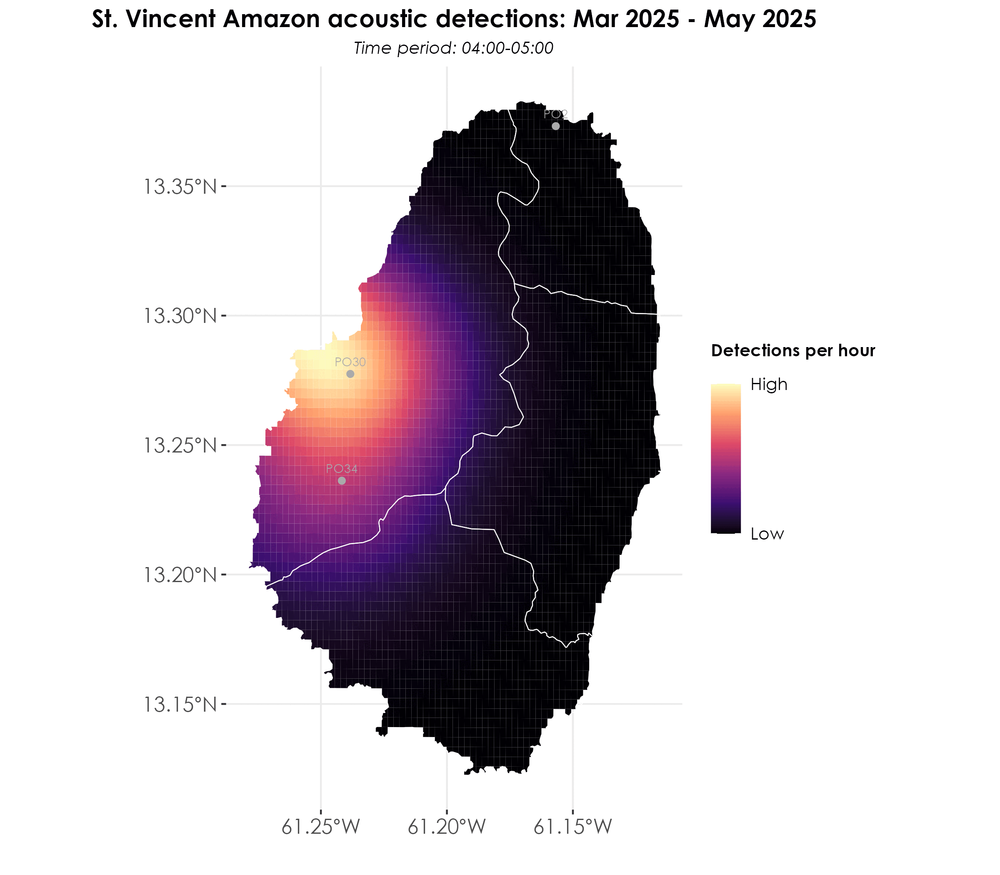

---
editor_options:
  chunk_output_type: console
---

# Spatiotemporal analyses of BirdNET detections

In this script, we carry out spatiotemporal analyses of acoustic detections. Specifically, we create kernel density maps of spatiotemporal variation in acoustic detections.  

## Load necessary libraries
```{r}
library(tidyverse)
library(dplyr)
library(stringr)
library(ggplot2)
library(data.table)
library(extrafont)
library(sf)
library(raster)
library(stars)
library(spatstat)
library(mapview)

# for plotting
library(scales)
library(ggplot2)
library(ggspatial)
library(colorspace)
library(scico)
library(RColorBrewer)
library(paletteer)
```

## Load acoustic data and metadata
```{r}
metadata <- read.csv("data/acoustic-metadata.csv")
acoustic_data <- read.csv("results/datSubset.csv")

# ensure structure of dates in the metadata file is date
metadata$first_file_date <- ymd(metadata$first_file_date)
metadata$last_file_date <- ymd(metadata$last_file_date)

## create a factor of survey_point_number ordered by range_name
metadata <- metadata %>%
  arrange(range_name, survey_point_number) %>%
  mutate(survey_point_ordered = factor(survey_point_number, 
                 levels = unique(survey_point_number)))

## total number of recorded days
recording_days <- metadata %>%
  rowwise() %>%
  mutate(
    days = list(seq(first_file_date, last_file_date, by = "day"))
  ) %>%
  unnest(days) %>%
  distinct(days, survey_point_number) %>%
  group_by(survey_point_number) %>%
  summarise(
    total_recording_days = n(),
    .groups = 'drop'
  ) %>%
  arrange(desc(total_recording_days)) %>%
  left_join(metadata %>% 
              dplyr::select(survey_point_number, range_name) %>% 
              distinct(),
            by = "survey_point_number")
```

## Creating a kernel density map of cumulative acoustic detections of the parrot across the island while controlling for sampling effort   
```{r}
## load shapefiles of ranges 
st_vincent <- st_read("data/spatial/range_layer.shp")
st_vincent <- st_transform(st_vincent, 4326)

## merge lat-long from metadata with the acoustic_data file
acoustic_data <- left_join(acoustic_data, metadata[,c(1,2,15:17)])

## convert to an sf object
acoustic_data <- st_as_sf(acoustic_data, coords = c("longitude", "latitude"), crs = st_crs(st_vincent))

# get cumulative acoustic detections
cumulative_detections <- acoustic_data %>%
   group_by(range_code, survey_point_number) %>%
  summarise(cumulative_detections = n())

## join recording days to cumulative detections
cumulative_detections <- left_join(cumulative_detections, 
                                   recording_days) %>%
  mutate(detections_by_effort = cumulative_detections/total_recording_days)

# convert geographic coordinate system to projected coordinate system
st_vincent <- st_vincent %>%
  st_transform(32620)

cumulative_detections <- cumulative_detections %>%
  st_transform(32620)

## create spatial points object to create KDE plot
## for information on using as.ppp, refer to spatstat.geom package 
spp <- as.ppp(st_coordinates(cumulative_detections), W = as.owin(st_vincent))
marks(spp) <- round(cumulative_detections$detections_by_effort)

## create a stars object prior to plotting using sf & ggplot2 
weights <- spp$marks

# scale weights from 0 to 1
# this was done to ensure that the scale of comparison is the same across months
range01 <- function(x){(x-min(x))/(max(x)-min(x))}
weights <- range01(weights)
density_obj <- stars::st_as_stars(density(spp, dimyx = 70, weights = weights,
                                          edge = TRUE)) 

## convert back to sf and change the CRS
density_obj <- st_as_sf(density_obj) 
st_crs(density_obj) <- 32620

density_obj <- st_intersection(density_obj, st_vincent) %>%
  st_transform(4326)

st_vincent <- st_vincent %>%
  st_transform(4326)

cumulative_detections <- cumulative_detections %>%
  st_transform(4326)

## visualization
fig_kdePlot <- ggplot() +
geom_sf(data = density_obj, aes(fill = v), color = NA) +
geom_sf(data = st_vincent, fill = NA, color = "white", linewidth = 0.25) +
  geom_sf(data = cumulative_detections, color = "darkgray", 
          shape = 21, fill = "darkgray") +
  geom_text(data = cumulative_detections, 
          aes(geometry = geometry, label = survey_point_number),
          stat = "sf_coordinates",
          vjust = -0.9, 
          hjust = 0.5, 
          size = 2.5,
          family = "Century Gothic", 
          color = "darkgray") +
  scale_fill_viridis_c(option = "magma", 
                     name = "Acoustic detections",
                     trans = "sqrt",  
                     breaks = c(min(density_obj$v), max(density_obj$v)),
                     labels = c("Low", "High"))+
theme_bw() +
  labs(x = '',
       y = '',
       size = 'Acoustic detections', color = 'Acoustic detections', 
       title = "Cumulative acoustic detections of the St. Vincent Amazon",
       subtitle = "Areas in black represent locations of no acoustic recording or very few detections") +
  theme(
    plot.title = element_text(
      family = "Century Gothic",
      size = 14, face = "bold", hjust = 0.5
    ),
    plot.subtitle = element_text(
      family = "Century Gothic",
      size = 10, face = "italic", hjust = 0.5
    ),
    axis.title = element_text(
      family = "Century Gothic",
      size = 14, face = "bold"
    ),
    axis.text = element_text(family = "Century Gothic", size = 12), 
    legend.position = "right",
    legend.title = element_text(family = "Century Gothic", size = 10, face = "bold", margin = margin(b = 15)), 
    legend.text = element_text(family = "Century Gothic", size = 10), 
    panel.border = element_blank()   
    ) 

ggsave(fig_kdePlot, filename = "figs/fig_kernelDensityMap_cumulativeDetections.png", width = 8, height = 7, device = png(), units = "in", dpi = 300)
dev.off()
```


## Kernel density maps for different months of data

Here, we replicate the above plot, but by creating a spatiotemporal series of plots for different months of sampling across the island. 

```{r}
## bin total recording days for each survey_point_number by different months
recording_days <- metadata %>%
  rowwise() %>%
  mutate(
    days = list(seq(first_file_date, last_file_date, by = "day"))
  ) %>%
  unnest(days) %>%
  mutate(
    month = case_when(
      days >= as.Date("2024-11-01") & days <= as.Date("2024-12-31") ~ "Nov 2024 - Jan 2025",
      days >= as.Date("2025-01-01") & days <= as.Date("2025-02-28") ~ "Jan 2025 - Mar 2025",
      days >= as.Date("2025-03-01") & days <= as.Date("2025-04-30") ~ "Mar 2025 - May 2025",
      days >= as.Date("2025-05-01") & days <= as.Date("2025-07-31") ~ "May 2025 - July 2025"
    )
  ) %>%
  distinct(days, survey_point_number, month) %>%
  group_by(month, survey_point_number) %>%
  summarise(
    recording_days = n(),
    .groups = 'drop'
  ) %>%
  mutate(month = factor(month, 
    levels = c("Nov 2024 - Jan 2025",
               "Jan 2025 - Mar 2025",
               "Mar 2025 - May 2025",
               "May 2025 - July 2025"))) %>%
  arrange(month, survey_point_number)

# generate detections by month
detections_by_month <- acoustic_data %>%
  mutate(
    date = as.Date(as.character(date), format = "%Y%m%d"),
    month = case_when(
      date >= as.Date("2024-11-01") & date <= as.Date("2024-12-31") ~ "Nov 2024 - Jan 2025",
      date >= as.Date("2025-01-01") & date <= as.Date("2025-02-28") ~ "Jan 2025 - Mar 2025",
      date >= as.Date("2025-03-01") & date <= as.Date("2025-04-30") ~ "Mar 2025 - May 2025",
      date >= as.Date("2025-05-01") & date <= as.Date("2025-07-31") ~ "May 2025 - July 2025"
    )
  ) %>%
  group_by(month, survey_point_number) %>%
  summarise(
    total_detections = n(),
    .groups = 'drop'
  ) %>%
  mutate(month = factor(month, 
    levels = c("Nov 2024 - Jan 2025",
               "Jan 2025 - Mar 2025",
               "Mar 2025 - May 2025",
               "May 2025 - July 2025"))) %>%
  arrange(month, survey_point_number)

# merge dataframes
monthly_detections <- left_join(detections_by_month, recording_days,
                              by = c("month", "survey_point_number"))

## replicate the KDE plots so that we can generate them by the monthly time periods

# create a list to store individual plots
monthly_kde_plots <- list()

# define months in chronological order
months <- c("Nov 2024 - Jan 2025", 
            "Jan 2025 - Mar 2025", 
            "Mar 2025 - May 2025", 
            "May 2025 - July 2025")

# creating a kde plot for each month
for(current_month in months) {
  
  # subset data for current month
  month_data <- monthly_detections %>%
    filter(month == current_month) %>%
    mutate(detections_by_effort = total_detections/recording_days)
  
  # transform coordinate systems
  st_vincent_proj <- st_vincent %>% st_transform(32620)
  month_data_proj <- month_data %>% st_transform(32620)
  
  # create spatial points object
  spp <- as.ppp(st_coordinates(month_data_proj), 
                W = as.owin(st_vincent_proj))
  marks(spp) <- round(month_data_proj$detections_by_effort)
  
  # create density object
  weights <- spp$marks
  range01 <- function(x){(x-min(x))/(max(x)-min(x))}
  weights <- range01(weights)
  density_obj <- stars::st_as_stars(density(spp, dimyx = 70, weights = weights, edge = TRUE))
  
  # Convert back to sf and transform CRS
  density_obj <- st_as_sf(density_obj) 
  st_crs(density_obj) <- 32620
  density_obj <- st_intersection(density_obj, 
                                 st_vincent_proj) %>% 
    st_transform(4326)
  
  # create plot
  p <- ggplot() +
    geom_sf(data = density_obj, aes(fill = v), color = NA) +
    geom_sf(data = st_vincent, fill = NA, color = "white", 
            linewidth = 0.25) +
    geom_sf(data = month_data, color = "darkgray", 
            shape = 21, fill = "darkgray") +
    geom_text(data = month_data, 
            aes(geometry = geometry, label = survey_point_number),
            stat = "sf_coordinates",
            vjust = -0.9, 
            hjust = 0.5, 
            size = 2.5,
            family = "Century Gothic", 
            color = "darkgray") +
  scale_fill_viridis_c(option = "magma", 
                     name = "Acoustic detections",
                     trans = "sqrt",  
                     breaks = c(min(density_obj$v), max(density_obj$v)),
                     labels = c("Low", "High")) +
    theme_bw() +
    labs(x = '',
         y = '',
         size = 'Acoustic detections', 
         color = 'Acoustic detections', 
         title = paste("St. Vincent Amazon acoustic detections:", current_month),
         subtitle ="Areas in black represent locations of no acoustic recording or very few detections") +
    theme(
      plot.title = element_text(
        family = "Century Gothic",
        size = 14, face = "bold", hjust = 0.5
      ),
    plot.subtitle = element_text(
      family = "Century Gothic",
      size = 10, face = "italic", hjust = 0.5
    ),
      axis.title = element_text(
        family = "Century Gothic",
        size = 14, face = "bold"
      ),
      axis.text = element_text(family = "Century Gothic", size = 12), 
      legend.position = "right",
      legend.title = element_text(family = "Century Gothic", size = 10, face = "bold", margin = margin(b = 15)), 
      legend.text = element_text(family = "Century Gothic", size = 10), 
      panel.border = element_blank()   
    )
  
  # save individual plot with numbered prefix for correct ordering
  month_number <- which(months == current_month)
  filename <- sprintf("figs/kde_%02d_%s.png", month_number, gsub(" ", "_", current_month))
  ggsave(filename = filename, plot = p, width = 8, height = 7, dpi = 300)
  
  # store plot in list
  monthly_kde_plots[[current_month]] <- p
}

# create GIF using magick package
library(magick)

# list all the PNG files in correct order
img_files <- list.files("figs", pattern = "kde_.*\\.png", full.names = TRUE)
img_files <- sort(img_files) 

# read images
imgs <- image_read(img_files)

# create GIF
gif <- image_animate(imgs, fps = 0.5)

# save GIF
image_write(gif, "figs/monthly_kde_animation.gif")
```


## Visualizing detections by time of day

Here, we visualize by time of day while weighting for the total recording hours for that time period.
```{r}
recording_hours_by_timeframe <- metadata %>%
  # first handle the dates and times
  mutate(
    # convert HHMMSS to decimal hours
    first_hour = as.numeric(substr(sprintf("%06d", first_file_time), 1, 2)),
    first_minute = as.numeric(substr(sprintf("%06d", first_file_time), 
                                     3, 4)) / 60,
    last_hour = as.numeric(substr(sprintf("%06d", last_file_time), 1, 2)),
    last_minute = as.numeric(substr(sprintf("%06d", last_file_time), 
                                    3, 4)) / 60,
    first_decimal_time = first_hour + first_minute,
    last_decimal_time = last_hour + last_minute,
    days = as.numeric(last_file_date - first_file_date),
    sampling_periods = str_split(aru_sampling_times, "; ")
  ) %>%
  unnest(sampling_periods) %>%
  separate(sampling_periods, into = c("start_time", "end_time"), 
           sep = "-") %>%
  # convert scheduled periods to decimal hours
  mutate(
    period_start_hour = as.numeric(substr(start_time, 1, 2)),
    period_end_hour = as.numeric(substr(end_time, 1, 2))
  ) %>%
  # generate hourly time frames
  rowwise() %>%
  mutate(
    hours = list(seq(period_start_hour, period_end_hour - 1))
  ) %>%
  unnest(hours) %>%
  # create time frame labels and calculate hours for each frame
  mutate(
    time_frame = sprintf("%02d:00-%02d:00", hours, hours + 1),
    # calculate hours for first day
    first_day_hours = case_when(
      hours >= first_hour ~ 1,  # full hour if after start
      hours + 1 > first_decimal_time ~ (hours + 1) - first_decimal_time,  
      # partial hour at start
      TRUE ~ 0
    ),
    # calculate hours for last day
    last_day_hours = case_when(
      hours + 1 <= last_hour ~ 1,  # full hour if before end
      hours < last_decimal_time ~ last_decimal_time - hours,  
      # partial hour at end
      TRUE ~ 0
    ),
    # calculate hours for middle days using case_when
    middle_days_hours = case_when(
      days > 0 ~ 1,
      TRUE ~ 0
    )
  ) %>%
  group_by(survey_point_number, time_frame) %>%
  summarise(
    total_hours = sum(first_day_hours + 
                     (middle_days_hours * (days - 1)) +  
                       # subtract 1 to not double count first/last days
                     last_day_hours),
    .groups = 'drop'
  ) %>%
  # add range information
  left_join(metadata %>% 
              dplyr::select(survey_point_number, range_name) %>% 
              distinct(),
            by = "survey_point_number") %>%
  # order time frames chronologically
  mutate(
    time_frame = factor(time_frame, 
                       levels = sort(unique(time_frame)))
  ) %>%
  arrange(survey_point_number, time_frame)


# get detections by timeframe
detections_by_timeframe <- acoustic_data %>%
  mutate(
    hour = as.numeric(substr(sprintf("%06d", time), 1, 2)),
    time_frame = sprintf("%02d:00-%02d:00", hour, hour + 1)
  ) %>%
  group_by(range_code, survey_point_number, time_frame) %>%
  summarise(total_detections = n(), .groups = 'drop') %>%
  mutate(
    time_frame = factor(time_frame, 
                       levels = sort(unique(time_frame)))
  )

# join with recording hours and calculate detections per hour
detections_per_hour <- detections_by_timeframe %>%
  left_join(recording_hours_by_timeframe, 
            by = c("survey_point_number", 
                   "time_frame")) %>%
  mutate(
    detections_per_hour = total_detections / total_hours
  ) 

# create the sequence of time frames in groups
morning_times <- c("04:00-05:00", "05:00-06:00", "06:00-07:00")
midday_times <- c("10:00-11:00", "11:00-12:00", "12:00-13:00", "13:00-14:00")
evening_times <- c("17:00-18:00", "18:00-19:00")

# combine all times but keep track of groups
time_sequence <- c(morning_times, midday_times, evening_times)

# recordering detections_per_hour dataframe
detections_per_hour_ordered <- detections_per_hour %>%
  # reorder time_frame factor levels
  mutate(
    time_frame = factor(time_frame, levels = time_sequence),
    # create a grouping variable
    time_group = case_when(
      time_frame %in% morning_times ~ 1,
      time_frame %in% midday_times ~ 2,
      time_frame %in% evening_times ~ 3
    )
  )

## visualization
fig_detections_per_hour <- detections_per_hour_ordered %>%
  ggplot(aes(x = time_frame, y = survey_point_number, fill = detections_per_hour)) +
  geom_tile(color = "black") + 
  scale_fill_gradientn(colours = c(brewer.pal(9, "Reds"))) +
  facet_grid(range_name ~ ., scales = "free_y", space = "free_y") +
  labs(title = "Detections per hour of St. Vincent Amazon across sites",
       x = "Time of day",
       y = "Survey Point Number",
       fill = "Detections\nper hour",
       subtitle = "Analysis controls for total recording hours") + 
  theme_bw() +
  theme(
    axis.title = element_text(
      family = "Century Gothic",
      size = 14, face = "bold"
    ),
    plot.title = element_text(family = "Century Gothic", 
                              size = 14, face = "bold"),
    plot.subtitle = element_text(family = "Century Gothic",
                                 face = "italic", size = 10),
    axis.text = element_text(family = "Century Gothic", size = 12),
    axis.text.x = element_text(angle = 45, hjust = 1),
    legend.title = element_text(family = "Century Gothic"),
    legend.text = element_text(family = "Century Gothic"),
    strip.text = element_text(
      family = "Century Gothic",
      size = 12, face = "bold"
    ),
    strip.background = element_rect(fill = "grey95"),
    panel.spacing.x = unit(1, "lines")
  ) +
  scale_x_discrete(
    breaks = time_sequence,
    expand = expansion(mult = 0.05),
    position = "bottom",
    drop = FALSE,
    limits = c(morning_times, "", midday_times, "", evening_times)  
  )

ggsave(fig_detections_per_hour, 
       filename = "figs/fig_detections_per_hour.png", 
       width = 14, height = 9, 
       device = png(), units = "in", dpi = 300)
dev.off()
```


## Detections by time of day and month

```{r}
# calculate recording hours by month and timeframe
recording_hours_by_month_timeframe <- metadata %>%
  # create date sequence for each point
  rowwise() %>%
  mutate(
    dates = list(seq(first_file_date, last_file_date, by = "day"))
  ) %>%
  unnest(dates) %>%
  # assign monthly periods
  mutate(
    month = case_when(
      dates >= as.Date("2024-11-01") & dates <= as.Date("2024-12-31") ~ "Nov 2024 - Jan 2025",
      dates >= as.Date("2025-01-01") & dates <= as.Date("2025-02-28") ~ "Jan 2025 - Mar 2025",
      dates >= as.Date("2025-03-01") & dates <= as.Date("2025-04-30") ~ "Mar 2025 - May 2025",
      dates >= as.Date("2025-05-01") & dates <= as.Date("2025-07-31") ~ "May 2025 - July 2025"
    ),
    # convert first and last file times to decimal hours
    first_hour = as.numeric(substr(sprintf("%06d", first_file_time), 1, 2)),
    first_minute = as.numeric(substr(sprintf("%06d", first_file_time), 3, 4)) / 60,
    last_hour = as.numeric(substr(sprintf("%06d", last_file_time), 1, 2)),
    last_minute = as.numeric(substr(sprintf("%06d", last_file_time), 3, 4)) / 60,
    first_decimal_time = first_hour + first_minute,
    last_decimal_time = last_hour + last_minute
  ) %>%
  # split sampling periods
  separate_rows(aru_sampling_times, sep = "; ") %>%
  separate(aru_sampling_times, into = c("start_time", "end_time"), sep = "-") %>%
  mutate(
    start_hour = as.numeric(substr(start_time, 1, 2)),
    end_hour = as.numeric(substr(end_time, 1, 2))
  ) %>%
  rowwise() %>%
  mutate(
    hours = list(seq(start_hour, end_hour - 1))
  ) %>%
  unnest(hours) %>%
  mutate(
    time_frame = sprintf("%02d:00-%02d:00", hours, hours + 1),
    # calculate daily hours
    daily_hours = case_when(
      # first day
      dates == first_file_date & hours < first_decimal_time ~ 0,
      dates == first_file_date & hours >= first_decimal_time ~ 1,
      # last day
      dates == last_file_date & hours >= last_decimal_time ~ 0,
      dates == last_file_date & hours < last_decimal_time ~ 1,
      # middle days - full hours within sampling period
      TRUE ~ 1
    )
  ) %>%
  # sum up actual hours
  group_by(survey_point_number, month, time_frame) %>%
  summarise(
    total_hours = sum(daily_hours),
    .groups = 'drop'
  )

# calculate detections by month and timeframe
detections_by_month_timeframe <- acoustic_data %>%
  mutate(
    date = as.Date(as.character(date), format = "%Y%m%d"),
    hour = as.numeric(substr(sprintf("%06d", time), 1, 2)),
    time_frame = sprintf("%02d:00-%02d:00", hour, hour + 1),
    month = case_when(
      date >= as.Date("2024-11-01") & date <= as.Date("2024-12-31") ~ "Nov 2024 - Jan 2025",
      date >= as.Date("2025-01-01") & date <= as.Date("2025-02-28") ~ "Jan 2025 - Mar 2025",
      date >= as.Date("2025-03-01") & date <= as.Date("2025-04-30") ~ "Mar 2025 - May 2025",
      date >= as.Date("2025-05-01") & date <= as.Date("2025-07-31") ~ "May 2025 - July 2025"
    )
  ) %>%
  group_by(survey_point_number, month, time_frame) %>%
  summarise(
    total_detections = n(),
    .groups = 'drop'
  )

# create final dataset
detections_per_hour_by_month <- detections_by_month_timeframe %>%
  # join with recording hours
  inner_join(recording_hours_by_month_timeframe, 
            by = c("survey_point_number", "month", "time_frame")) %>%
  # add coordinates
  left_join(metadata %>% 
              dplyr::select(survey_point_number, longitude, latitude) %>% 
              distinct(),
            by = "survey_point_number") %>%
  # calculate detections per hour
  mutate(
    detections_per_hour = total_detections / total_hours
  ) %>%
  # convert to sf object
  st_as_sf(coords = c("longitude", "latitude"), crs = 4326) %>%
  # factor the month variable for proper ordering
  mutate(month = factor(month, 
                       levels = c("Nov 2024 - Jan 2025",
                                "Jan 2025 - Mar 2025",
                                "Mar 2025 - May 2025",
                                "May 2025 - July 2025")))

# create a list to store individual plots
monthly_hourly_kde_plots <- list()

# define months and time periods
months <- c("Nov 2024 - Jan 2025", 
            "Jan 2025 - Mar 2025", 
            "Mar 2025 - May 2025", 
            "May 2025 - July 2025")

# get unique time frames from your data
time_frames <- sort(unique(detections_per_hour_by_month$time_frame))

# creating a kde plot for each month and time frame combination
for(current_month in months) {
  for(current_time in time_frames) {
    
    # subset data for current month and time frame
    period_data <- detections_per_hour_by_month %>%
      filter(month == current_month,
             time_frame == current_time,
             !is.na(detections_per_hour))  # Remove NA values
    
    # only proceed if we have enough data
    if(nrow(period_data) >= 3) {  # KDE needs at least 3 points
      # transform coordinate systems
      st_vincent_proj <- st_vincent %>% st_transform(32620)
      period_data_proj <- period_data %>% st_transform(32620)
      
      # create spatial points object
      spp <- as.ppp(st_coordinates(period_data_proj), 
                    W = as.owin(st_vincent_proj))
      
      # handle weights
      weights <- period_data_proj$detections_per_hour
      if(all(weights == 0)) {
        # skip this period if all weights are zero
        next
      }
      
      # normalize weights to avoid extremely small values
      range01 <- function(x){(x-min(x))/(max(x)-min(x))}
      weights <- range01(weights)
      
      # check for NA/NaN in weights
      if(any(is.na(weights))) {
        print(paste("NA weights found in", current_month, current_time))
        next
      }
      
      # create density object
      density_obj <- stars::st_as_stars(density(spp, dimyx = 70, 
                                              weights = weights, 
                                              edge = TRUE))
      
      # Convert back to sf and transform CRS
      density_obj <- st_as_sf(density_obj) 
      st_crs(density_obj) <- 32620
      density_obj <- st_intersection(density_obj, st_vincent_proj) %>% 
        st_transform(4326)
      
      # create plot
      p <- ggplot() +
        geom_sf(data = density_obj, aes(fill = v), color = NA) +
        geom_sf(data = st_vincent, fill = NA, color = "white", 
                linewidth = 0.25) +
        geom_sf(data = period_data, color = "darkgray", 
                shape = 21, fill = "darkgray") +
        geom_text(data = period_data, 
                aes(geometry = geometry, label = survey_point_number),
                stat = "sf_coordinates",
                vjust = -0.9, 
                hjust = 0.5, 
                size = 2.5,
                family = "Century Gothic", 
                color = "darkgray") +
        scale_fill_viridis_c(option = "magma", 
                         name = "Detections per hour",
                         trans = "sqrt",  
                         breaks = c(min(density_obj$v), max(density_obj$v)),
                         labels = c("Low", "High")) +
        theme_bw() +
        labs(x = '',
             y = '',
             size = 'Detections per hour', 
             color = 'Detections per hour', 
             title = paste("St. Vincent Amazon acoustic detections:", 
                          current_month),
             subtitle = paste("Time period:", current_time)) +
        theme(
          plot.title = element_text(
            family = "Century Gothic",
            size = 14, face = "bold", hjust = 0.5
          ),
          plot.subtitle = element_text(
            family = "Century Gothic",
            size = 10, face = "italic", hjust = 0.5
          ),
          axis.title = element_text(
            family = "Century Gothic",
            size = 14, face = "bold"
          ),
          axis.text = element_text(family = "Century Gothic", size = 12),
          legend.position = "right",
          legend.title = element_text(
            family = "Century Gothic", 
            size = 10, face = "bold", 
            margin = margin(b = 15)
          ),
          legend.text = element_text(family = "Century Gothic", size = 10),
          panel.border = element_blank()
        )
      
      # save individual plot
      time_number <- which(time_frames == current_time)
      month_number <- which(months == current_month)
      filename <- sprintf("figs/kde_%02d_%02d_%s_%s.png", 
                         month_number, time_number,
                         gsub(" ", "_", current_month),
                         gsub(":", "", current_time))
      ggsave(filename = filename, plot = p, width = 8, height = 7, dpi = 300)
      
      # store plot in list
      monthly_hourly_kde_plots[[paste(current_month, current_time)]] <- p
    }
  }
}

# create separate GIFs for each month
library(magick)

for(current_month in months) {
  # list all the PNG files for current month in correct order
  month_pattern <- paste0("kde_.*", gsub(" ", "_", current_month))
  img_files <- list.files("figs", pattern = month_pattern, full.names = TRUE)
  img_files <- sort(img_files)
  
  # Only proceed if we have files
  if(length(img_files) > 0) {
    # read images
    imgs <- image_read(img_files)
    
    # create GIF
    gif <- image_animate(imgs, fps = 0.5)
    
    # save GIF
    gif_filename <- paste0("figs/monthly_kde_animation_by_time_of_day", 
                          gsub(" ", "_", current_month), ".gif")
    image_write(gif, gif_filename)
  }
}
```





